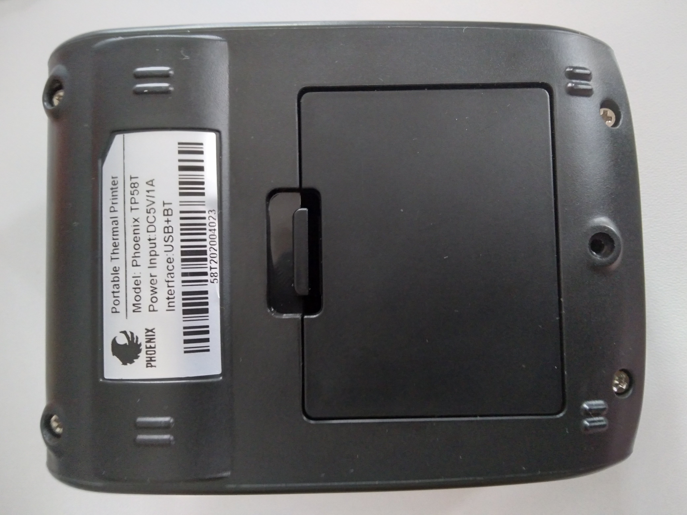
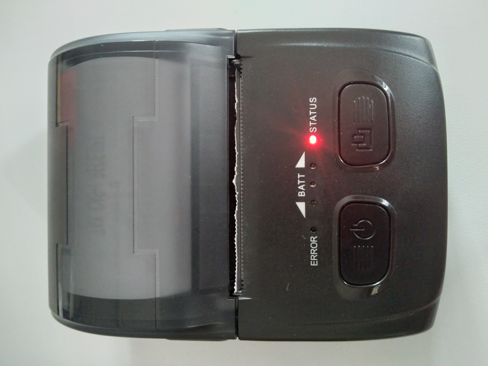

# Flutter Thermal Bluetooth Printer App

A bluetooth thermal printer demo app.

Print texts, qr codes and images through a flutter mobile app.

This is a demo app and is meant to aid the programmer on how to connect a flutter based app to a bluetooth thermal printer. It detects bluetooth devices and connects to a bluetooth printer sending a command to the printer on what to print.

This is just a demo app and is not for sale.

## Flutter and dart version
flutter 2.10.4 \
dart 2.16.2

## Packages used
bluetooth_thermal_printer: ^0.0.6 \
qr_flutter: ^4.0.0 \
path_provider: ^2.0.11 \
esc_pos_utils: ^1.1.0 \
barcode: any \
barcode_image: any

## Printer used
The printer used for this demonstration was Phoenix TP58T shown below.

## Photos and screenshots
